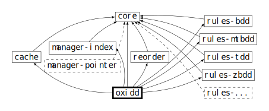

# OxiDD

OxiDD is a highly modular decision diagram framework written in Rust. The most prominent instance of decision diagrams is provided by [(reduced ordered) binary decision diagrams (BDDs)](https://en.wikipedia.org/wiki/Binary_decision_diagram), which are succinct representations of Boolean functions $\mathbb B^n \to \mathbb B$. Such BDD representations are canonical and thus, deciding equality of Boolean functions—in general an NP-complete problem—can be done in constant time. Further, many Boolean operations on two BDDs $f,g$ are possible in $\mathcal O(|f|\cdot|g|)$ (where $|f|$ denotes the node count in $f$). There are various other kinds of decision diagrams for which OxiDD aims to be a framework enabling high-performance implementations with low effort.


## Features

- **Several kinds of (reduced ordered) decision diagrams** are already implemented:
    - Binary decision diagrams (BDDs)
    - BDDs with complement edges (BDDCs)
    - Zero-suppressed BDDs (ZBDDs, aka ZDDs/ZSDDs)
    - Multi-terminal BDDs (MTBDDs, aka ADDs)
    - Ternary decision diagrams (TDDs)
- **Extensibility**: Due to OxiDD’s modular design, one can implement new kinds of decision diagrams without having to reimplement core data structures.
- **Concurrency**: Functions represented by DDs can safely be used in multi-threaded contexts. Furthermore, apply algorithms can be executed on multiple CPU cores in parallel.
- **Performance**: Compared to other popular BDD libraries (e.g., BuDDy, CUDD, and Sylvan), OxiDD is already competitive or even outperforms them.
- **Support for Reordering**: OxiDD can reorder a decision diagram to a given variable order. Support for dynamic reordering, e.g., via sifting, is about to come.


## Getting Started

Constructing a BDD for the formula $(x_1 \land x_2) \lor x_3$ works as follows:

```Rust
// Create a manager for up to 2048 nodes, up to 1024 apply cache entries, and
// use 8 threads for the apply algorithms. In practice, you would choose higher
// capacities depending on the system resources.
let manager_ref = oxidd::bdd::new_manager(2048, 1024, 8);
let (x1, x2, x3) = manager_ref.with_manager_exclusive(|manager| {(
      BDDFunction::new_var(manager).unwrap(),
      BDDFunction::new_var(manager).unwrap(),
      BDDFunction::new_var(manager).unwrap(),
)});
// The APIs are designed such that out-of-memory situations can be handled
// gracefully. This is the reason for the `?` operator.
let res = x1.and(&x2)?.or(&x3)?;
println!("{}", res.satisfiable());
```

(We will add a more elaborate guide in the future.)


## Project Structure

The main code is located in the [crates](crates) directory. The framework is centered around a bunch of core traits, found in the `oxidd-core` crate. These traits are the abstractions enabling to easily swap one component by another, as indicated by the dependency graph below. The data structure in which DD nodes are stored is mostly defined by the `oxidd-manager-index` crate. There is also the `oxidd-manager-pointer` crate, which contains an alternative implementation (here, the edges are represented by pointers instead of 32 bit indices). Implementations of the apply cache can be found in the `oxidd-cache` crate. Reduction rules and main algorithms of the various DD kinds are implemented in the `oxidd-rules-*` crates. There are different ways how all the components can be “plugged” together. The `oxidd` crate provides sensible default instantiations for the end user. There are a few more crates, but the aforementioned are the most important ones.




## FAQ

Q: Why is the `oxidd` crate on crates.io empty?

A: OxiDD is not yet fully mature. Currently, we have some ideas in mind that will probably cause breaking changes. We decided to postpone the release on crates.io until we are a bit more confident that APIs won’t change a lot anymore. This is expected to happen in the course of 2024.

Q: What about bindings for language X?

OxiDD has a foreign function interface (FFI) located in the `oxidd-ffi` crate. It does not expose the entire API that can be used from Rust, but it is sufficient to, e.g., create BDDs and apply various logical operators on them. In principle, you can use the FFI from any language that can call C functions. However, there are also more ergonomic C++ bindings that build on top of the C FFI. They will soon-ish be added to this repository. Additionally, we are planning to provide Python bindings.


## Licensing

OxiDD is licensed under either [MIT](LICENSE-MIT) or [Apache 2.0](LICENSE-APACHE) at your opinion.

Unless you explicitly state otherwise, any contribution intentionally submitted for inclusion in this project by you, as defined in the Apache 2.0 license, shall be dual licensed as above, without any additional terms or conditions.


## Publications

The seminal paper presenting OxiDD is not yet published, but accepted for publication at TACAS'24. If you use OxiDD, please cite us as:

Nils Husung, Clemens Dubslaff, Holger Hermanns, and Maximilian A. Köhl: *OxiDD: A safe, concurrent, modular, and performant decision diagram framework in Rust.* In: Proceedings of the 30th International Conference on Tools and Algorithms for the Construction and Analysis of Systems (TACAS’24) (accepted for publication 2024)

    @inproceedings{oxidd24,
      author        = {Husung, Nils and Dubslaff, Clemens and Hermanns, Holger and K{\"o}hl, Maximilian A.},
      booktitle     = {Proceedings of the 30th International Conference on Tools and Algorithms for the Construction and Analysis of Systems (TACAS'24)},
      month         = {accepted for publication},
      title         = {{OxiDD}: A Safe, Concurrent, Modular, and Performant Decision Diagram Framework in {Rust}},
      year          = {2024}
    }


## Acknowledgements

This work is partially supported by the German Research Foundation (DFG) under the projects TRR 248 (see https://perspicuous-computing.science, project ID 389792660) and EXC 2050/1 (CeTI, project ID 390696704, as part of Germany’s Excellence Strategy).
